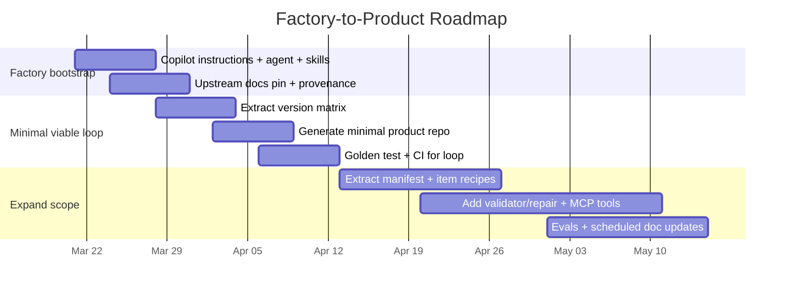

# Factory Repo Plan for Copilot-Enabled Minecraft Bedrock Add-On Tooling

## Executive summary

A **Copilot-centered, documentation-distilled, skills-enabled, MCP-powered** tooling system for creating **Minecraft Bedrock add-ons** with stronger reliability, explicit version targeting, deterministic validation, and repair-first workflows.

You are building two separate artifacts:

- A **factory repo** (authoring + automation): uses **GitHub Copilot** to maintain a pinned snapshot of **Minecraft Bedrock creator documentation**, extract machine-readable rules, generate the **product repo**, test it, and publish it.
- A **product repo** (end-user workspace): the generated, Copilot-customized repo in which **GitHub Copilot** can reliably create add-ons using custom instructions, prompt files, skills, and agent profiles with deterministic MCP tools.

This report gives a concise, prioritized road map built on primary sources from **GitHub Copilot documentation** and **Microsoft / Mojang creator documentation**.

The recommended strategy is to anchor the factory repo on the **official Bedrock documentation source repository** ([MicrosoftDocs/minecraft-creator](https://github.com/MicrosoftDocs/minecraft-creator), CC-BY-4.0 + MIT) so the docs are *actually in the factory repo’s dependency graph*, with clear provenance and reproducible extraction.

The simplest efficient roadmap is to implement a **Minimal Viable Loop**:

**snapshot → extract → generate → test → publish**

…and make it the only “happy path” in CI until you expand scope. This mirrors GitHub’s guidance that agents perform better with clear scope and acceptance criteria, and when they can build/test/validate changes. 

## Table of contents

- [Goals, assumptions, and minimal viable loop](#goals-assumptions-and-minimal-viable-loop)
- [Factory and product repo architecture](#factory-and-product-repo-architecture)
- [Documentation strategy](#documentation-strategy)
- [Skills strategy](#skills-strategy)
- [Agent model](#agent-model)
- [Roadmap and first tasks](#roadmap-and-first-tasks)
- [Copilot configuration and governance](#copilot-configuration-and-governance)
- [Testing, provenance, CI, and release](#testing-provenance-ci-and-release)

## Goals, assumptions, and minimal viable loop

### Goals

- Make the factory repo the **single source of truth** for:
  - upstream Bedrock docs snapshot (pinned)
  - extracted rules (machine-readable)
  - generated product repo contents (Copilot surfaces + tooling)
- Generate a product repo that enables Copilot to create Bedrock add-ons with:
  - explicit version policy and “N-1” targeting guidance
  - file/pack structure correctness
  - validation and repair gates based on official tooling/rules (MCTools)
- Use Copilot to build the factory repo efficiently by giving it:
  - repo-wide + path-specific instructions
  - factory-specific skills
  - a “Factory Engineer” custom agent
  - guardrails (hooks, allowlists, governance)

These are grounded in GitHub Copilot’s supported customization surfaces: repository instructions, path-specific instructions, agent instructions, skills, custom agents, and MCP. 

### Assumptions and constraints (explicitly open-ended)

**Unspecified by user (must decide later):**
- Repo hosting platform (assumed GitHub-compatible; see constraint below).
- CI provider (plan includes GitHub Actions as the default *if hosted on GitHub*).
- Programming language/runtime for generators and MCP tools (plan recommends Node/TypeScript because official MCTools CLI is distributed via npm, but you may choose otherwise). 
- Target Bedrock release line (stable vs preview) and experimental toggles policy (e.g., Custom Components V2 requires experiments). 
- Where the generated product is published: dedicated repo, template repo, release artifacts, monorepo subtree, etc.

**Hard constraints from primary sources:**
- Copilot coding agent **only works with repositories hosted on GitHub**. 
- Agent Skills are supported by coding agent, Copilot CLI, and VS Code Insiders agent mode; stable VS Code support is “coming soon.” 
- Prompt files are in public preview and only available in VS Code, Visual Studio, and JetBrains IDEs. 
- Copilot coding agent MCP support is **tools-only** (no resources/prompts), and tools can be used autonomously without approval once configured. 

### Minimal Viable Loop

This is the smallest end-to-end loop that proves the factory:

1. **Snapshot**
   - Pin a specific commit of **MicrosoftDocs/minecraft-creator** in the factory repo (submodule or vendored subtree).
   - Record commit hash + source registry/provenance. 

2. **Extract**
   - Extract one machine-readable artifact (start with `version-matrix.json`) from “Latest Platform Version Guidance,” which defines file-type minimum versions and N-1 logic. 

3. **Generate**
   - Generate a minimal product repo containing:
     - `.github/copilot-instructions.md`
     - `.github/skills/…` (at least one skill)
     - `docs/bedrock/version-policy.md` derived from extracted matrix
     - a starter examples folder structure aligned with pack contents rules 

4. **Test**
   - Golden test the generated repo tree (snapshot test).
   - Run an official validation pass via MCTools CLI (or stub in MVP if you haven’t wired it yet). MCTools provides validation and analytics and is available as a CLI via npm. 

5. **Publish**
   - Publish the generated product repo (method unspecified): push to a second repo, produce an artifact, or update a template repo.

This loop should be runnable locally and in CI, and it should be the acceptance gate for every PR in the factory repo.

## Documentation strategy

This project treats official Bedrock documentation snapshots as the canonical source for extraction, version policy, and generated repository behavior.

## Skills strategy

This project uses **Copilot skills** for repeatable, Bedrock-specific workflows.

Skills are the right place for tasks that need more than a one-off prompt, such as:

- creating a custom item
- creating a custom block
- repairing a broken pack
- upgrading a pack to the current version policy
- packaging a validated add-on

In this repository:

- **Custom instructions** define always-on Bedrock rules and standards
- **Prompt files** handle focused one-time workflows
- **Skills** package reusable Bedrock capabilities with instructions, examples, templates, and scripts
- **MCP tools** provide deterministic live actions such as validation, lookup, repair support, and packaging

Each skill should live in its own directory and include a `SKILL.md` file. Supporting resources such as examples, templates, markdown references, and scripts should live alongside it.

> Skills are used for repeatable Bedrock workflows. Repository-wide and path-specific instructions remain the always-on rules. Prompt files remain useful for focused one-time tasks.

## Agent model

Agents orchestrate multi-step workflows across instructions, prompts, skills, and MCP-backed deterministic tools.

## Factory and product repo architecture

### Why documentation must be “in” the factory repo

The factory’s outputs must be traceable to official sources. The most robust approach is to include the official Bedrock docs as a pinned dependency via **MicrosoftDocs/minecraft-creator** (CC-BY-4.0 and MIT licenses are present in the repo). 

That gives you:
- reproducibility (pinned commit)
- traceability (file path + line references)
- a legal and maintainable way to store docs snapshots (license explicitly surfaced in repo UI) 

### Exact factory repo layout

```text
bedrock-tooling-factory/
  README.md

  .github/
    copilot-instructions.md
    instructions/
      docs-upstream.instructions.md
      docs-extracted.instructions.md
      source-product.instructions.md
      packages-code.instructions.md
      tests-evals.instructions.md
    agents/
      factory-engineer.agent.md
    skills/
      snapshot-upstream-doc/
        SKILL.md
        scripts/
      extract-rule/
        SKILL.md
        scripts/
      regenerate-product/
        SKILL.md
        scripts/
    hooks/
      hooks.json

  vendor/
    minecraft-creator-docs/        # pinned submodule (recommended)
    # or: subtree snapshot

  docs/
    upstream/                      # optional: copied/minified subset; source-of-truth is vendor/
      sources.md
    extracted/
      version-matrix.json
      recipes/
        manifest.recipe.json
        item.recipe.json
      validation/
        mctools-rule-map.json
    curated/
      product-contract.md
      authoring-guides/
      decisions/                   # ADRs
    provenance/
      source-index.json
      extraction-log.jsonl
      changelog.md

  schemas/
    extracted/
      version-matrix.schema.json
      recipe.schema.json
      validation-map.schema.json
    internal/
      addon-spec.schema.json

  packages/
    doc-ingestion/
    extractor/
    product-assembler/
    test-harness/
    shared/

  templates/
    product-repo/
      .github/
      docs/
      tools/
      examples/

  tests/
    golden/
    unit/
    integration/

  evals/
    scenarios/
    metrics/
    reports/

  outputs/
    product-repo/                  # generated working tree
    release-bundle/
```

### Exact generated product repo layout

```text
bedrock-addon-tooling/                     # generated output repo
  README.md

  .github/
    copilot-instructions.md
    instructions/
      manifest.instructions.md
      items.instructions.md
      blocks.instructions.md
      entities.instructions.md
      scripts.instructions.md
    prompts/
      create-item.prompt.md
      create-block.prompt.md
      repair-pack.prompt.md
      upgrade-version.prompt.md
    skills/
      create-bedrock-item/
        SKILL.md
        examples/
        templates/
        scripts/
      create-bedrock-block/
        SKILL.md
        examples/
        templates/
        scripts/
      repair-bedrock-pack/
        SKILL.md
        examples/
        scripts/
      upgrade-bedrock-version/
        SKILL.md
        migration-rules/
        scripts/
      package-bedrock-addon/
        SKILL.md
        scripts/
    agents/
      bedrock-addon-engineer.agent.md

  .vscode/
    mcp.json                               # optional, for Copilot Chat MCP sharing

  docs/
    bedrock/
      version-policy.md
      version-matrix.json
      recipes/
      migration-notes/
      provenance/

  tools/
    bedrock-mcp/                           # MCP server implementation + tool defs
    bedrock-cli/                           # CLI wrapper for validate/repair/package

  examples/
    gold/
    broken/
    smoke/

  behavior_packs/
  resource_packs/
```

Notes:
- `.github/copilot-instructions.md` is the supported file name/location for repository-wide instructions.
- Path-specific instructions live under `.github/instructions/**/*.instructions.md` and can include an `applyTo` field.
- Skills are stored under `.github/skills` and are folders (SKILL.md + resources).
- Custom agents are defined as Markdown agent profiles with YAML frontmatter in `.github/agents`.
- MCP for Copilot Chat can be shared via `.vscode/mcp.json`.

### Example: product contract snippet

```md
# Product Repo Contract (v0)

## Purpose
This repository must enable GitHub Copilot to reliably create Minecraft Bedrock add-ons via:
- version-aware generation
- deterministic validation/repair
- consistent pack structure

## Required directories
- .github/copilot-instructions.md
- .github/instructions/
- .github/skills/
- .github/agents/
- docs/bedrock/
- tools/bedrock-mcp/
- examples/gold/ and examples/broken/

## Required gates
- Every change that generates add-on artifacts must run:
  validate -> repair (if needed) -> validate

## Version policy
- docs/bedrock/version-policy.md is the single source of truth.
- docs/bedrock/version-matrix.json is machine-consumed by tools.
```

## Required components and interfaces

### Components you need (what they do, and where they live)

These are the **minimum** components to satisfy your stated scope.

| Component | Lives in | Purpose | Primary sources that justify it |
|---|---|---|---|
| Documentation snapshot | Factory | Pin upstream Bedrock docs as a stable input | [MicrosoftDocs/minecraft-creator](https://github.com/MicrosoftDocs/minecraft-creator) + repository licenses (CC-BY-4.0, MIT) |
| Doc ingestion | Factory | Update pinned snapshot + record provenance | [MicrosoftDocs/minecraft-creator](https://github.com/MicrosoftDocs/minecraft-creator) + provenance/governance requirements in this plan |
| Extraction schemas | Factory | Validate extracted JSON outputs (prevent silent drift) | Internal engineering control for deterministic CI and contract enforcement |
| Version matrix extractor | Factory | Convert official version guidance into `version-matrix.json` | [Latest Platform Version Guidance](https://learn.microsoft.com/en-us/minecraft/creator/documents/bedrockversioning?view=minecraft-bedrock-stable) |
| Recipe extractor | Factory | Convert doc rules (manifest fields, pack contents) into “recipes” | [Pack contents](https://learn.microsoft.com/en-us/minecraft/creator/documents/addonpackcontents?view=minecraft-bedrock-stable) + [manifest.json reference](https://learn.microsoft.com/en-us/minecraft/creator/reference/content/addonsreference/examples/addonmanifest?view=minecraft-bedrock-stable) |
| Spec schema (IR for add-on requests) | Product (and mirrored in factory schemas) | A stable intermediate representation so generation is consistent | [Copilot coding agent best practices](https://docs.github.com/en/copilot/how-tos/use-copilot-agents/coding-agent/assign-tasks-to-copilot) (clear scope + acceptance criteria) |
| Recipe engine | Product | Map spec → file tree plan (what files go where) | [Behavior packs](https://learn.microsoft.com/en-us/minecraft/creator/documents/behaviorpack?view=minecraft-bedrock-stable) + [Resource packs](https://learn.microsoft.com/en-us/minecraft/creator/documents/resourcepack?view=minecraft-bedrock-stable) + [Pack contents](https://learn.microsoft.com/en-us/minecraft/creator/documents/addonpackcontents?view=minecraft-bedrock-stable) |
| Validator | Product | Deterministic correctness checks; use MCTools where possible | [MCTools CLI and validation docs](https://learn.microsoft.com/en-us/minecraft/creator/documents/mctools?view=minecraft-bedrock-stable) |
| Repair engine | Product | Minimal fixes from validator output; auto-fix when available | [MCTools validation rules](https://learn.microsoft.com/en-us/minecraft/creator/documents/mctools?view=minecraft-bedrock-stable) + manifest rule references |
| MCP server tools | Product | Tool API layer Copilot calls for validate/repair/package | [MCP overview](https://modelcontextprotocol.io/introduction) + [Copilot coding agent MCP support](https://docs.github.com/en/copilot/how-tos/use-copilot-agents/coding-agent/extend-copilot-coding-agent-with-mcp) |
| CLI | Product | Local deterministic entrypoints (`validate`, `repair`, `package`) | [MCTools CLI](https://learn.microsoft.com/en-us/minecraft/creator/documents/mctools?view=minecraft-bedrock-stable) |
| Skills | Factory and Product | Repeatable workflows that load on-demand | [Copilot skills](https://docs.github.com/en/copilot/how-tos/configure-custom-instructions/add-repository-instructions#about-skills-for-github-copilot) + `.github/skills` convention |

### Bedrock-specific anchors you must explicitly model

To prevent Copilot from “guessing,” extracted rules must cover these first:

- **Pack topology & folder constraints**: Bedrock only uses content if file type and folder placement are correct. 
- **Behavior pack vs resource pack roles**: behavior packs define behaviors and gameplay JSON; resource packs define textures/models/sounds. 
- **Versioning complexity**: format versions vary by file type and are validated against minimums; guidance follows an N-1 pattern and updates over time. 
- **manifest.json rules**: manifest fields, dependencies and module details are officially specified; format_version 3 is preview; dependencies can include built-in scripting module names like `@minecraft/server`. 
- **Validation baseline**: MCTools provides published rule categories and detailed rule sets like manifest validation. 
- **Scripting/custom components**: custom components connect JSON to script; Custom Components V2 changes attachment model; experiments may be required in some cases. 
- **Update cadence**: creator update notes can include breaking schema strictness and format-version changes; version numbering policy changed for 2026 releases. 

### Example: internal add-on spec schema snippet

```json
{
  "$schema": "https://json-schema.org/draft/2020-12/schema",
  "$id": "https://example.local/schemas/addon-spec.schema.json",
  "title": "AddonSpec",
  "type": "object",
  "required": ["name", "namespace", "target", "artifacts"],
  "properties": {
    "name": { "type": "string", "minLength": 1 },
    "namespace": { "type": "string", "pattern": "^[a-z0-9_\\-]+$" },
    "target": {
      "type": "object",
      "required": ["releaseChannel", "versionPolicy"],
      "properties": {
        "releaseChannel": { "enum": ["stable", "preview"] },
        "versionPolicy": { "enum": ["N", "N-1", "pinned"] }
      }
    },
    "packs": {
      "type": "object",
      "properties": {
        "behavior": { "type": "boolean" },
        "resource": { "type": "boolean" }
      },
      "additionalProperties": false
    },
    "artifacts": {
      "type": "array",
      "items": {
        "type": "object",
        "required": ["kind", "id"],
        "properties": {
          "kind": { "enum": ["manifest", "item", "block", "entity", "script", "loot", "recipe"] },
          "id": { "type": "string" }
        }
      }
    },
    "acceptance": {
      "type": "array",
      "items": { "type": "string" }
    }
  }
}
```

## Quick start

### 1. Create the repository skeleton
Create the factory and generated product structure shown in this document.

### 2. Add documentation ingestion and extraction
Pin upstream docs and produce a deterministic `version-matrix.json`.

### 3. Add AI control surfaces
Create repository instructions, path-specific instructions, and an initial agent profile.

### 4. Add initial Copilot skills

Create the first Bedrock skills:

- `.github/skills/create-bedrock-item/SKILL.md`
- `.github/skills/create-bedrock-block/SKILL.md`
- `.github/skills/repair-bedrock-pack/SKILL.md`
- `.github/skills/upgrade-bedrock-version/SKILL.md`
- `.github/skills/package-bedrock-addon/SKILL.md`

### 5. Wire MCP tools and validation
Connect deterministic validation/repair/package actions through MCP tools.

### 6. Run the workflow
Run snapshot -> extract -> generate -> test -> publish as the default loop.

## Roadmap and first tasks

### Implementation phases (prioritized)

**Phase: Factory bootstrap (Copilot-ready)**
- Establish Copilot control surfaces in the factory repo first, so Copilot can safely author the rest.

**Phase: Minimal Viable Loop**
- Implement the snapshot→extract→generate→test→publish loop for one extracted artifact and one product repo skeleton.

**Phase: Expand extraction**
- Add recipes for manifest + one artifact family (items) using official docs + pack contents constraints.

**Phase: Product tooling**
- Add validator/repair CLI and MCP tools wired to MCTools validation rules.

**Phase: Scale and harden**
- Add eval scenarios, metrics, governance hooks, and a scheduled upstream update workflow.

### Phase 2 — Copilot control checklist

- [ ] Create `.github/skills/create-bedrock-item/SKILL.md`
- [ ] Create `.github/skills/create-bedrock-block/SKILL.md`
- [ ] Create `.github/skills/repair-bedrock-pack/SKILL.md`
- [ ] Create `.github/skills/upgrade-bedrock-version/SKILL.md`
- [ ] Create `.github/skills/package-bedrock-addon/SKILL.md`

### Mermaid timeline (illustrative)



### First 12 tasks/files to create (highly actionable)

These are the first moves that let Copilot start doing real work immediately. They are written to be **well-scoped**, because GitHub documents that Copilot performs best when tasks include clear descriptions and acceptance criteria. 

| # | Task / file | Owner | Purpose | Acceptance criteria |
|---|---|---|---|---|
| 1 | `README.md` (factory) | Human + Copilot | Declare factory vs product boundaries and MVP loop | README explains snapshot→extract→generate→test→publish and forbids manual edits to `outputs/` |
| 2 | `.github/copilot-instructions.md` (factory) | Copilot | Make Copilot safe/effective in factory | Contains “edit source not outputs,” “update provenance,” “run tests before done” |
| 3 | `.github/instructions/docs-upstream.instructions.md` | Copilot | Path rules for upstream docs handling | Mentions no rewriting upstream; only pin/update; maintain provenance |
| 4 | `.github/instructions/packages-code.instructions.md` | Copilot | Coding standards for generators/extractors | Defines test expectations, error handling, deterministic outputs |
| 5 | `.github/agents/factory-engineer.agent.md` | Copilot | Custom agent profile for factory work | YAML frontmatter + explicit workflow; tools scoped; reproducible steps |
| 6 | `.github/skills/snapshot-upstream-doc/SKILL.md` | Copilot | Repeatable “add/update doc source” workflow | Includes checklist: pin commit, record provenance, run extraction |
| 7 | `docs/curated/product-contract.md` | Human + Copilot | Contract for what product repo must contain | Lists required dirs/files/gates; failure is test-breaking |
| 8 | `vendor/minecraft-creator-docs/` pinned (task) | Human | Bring Bedrock docs into dependency graph | Submodule/subtree pinned to commit; recorded in provenance |
| 9 | `docs/provenance/source-index.json` | Copilot | Central registry of upstream sources | Contains repo URL, commit hash, paths used, update cadence |
|10| `schemas/extracted/version-matrix.schema.json` | Copilot | Validate extracted version matrix | Schema validates format + required fields |
|11| `packages/extractor/src/extract-version-matrix.*` | Copilot | Implement first extractor from upstream docs | Produces deterministic `docs/extracted/version-matrix.json` |
|12| `packages/product-assembler/src/build-product.*` + `templates/product-repo/` | Copilot | Generate minimal product repo | `outputs/product-repo/` matches contract; golden test passes |

## Copilot configuration and governance

### Recommended Copilot configuration for the factory repo

**Repository-wide instructions**
- Create `.github/copilot-instructions.md` in repo root. 

**Path-specific instructions**
- Use `.github/instructions/**/*.instructions.md` (and `applyTo` where supported). 

**Agent instructions (optional but useful)**
- Use `AGENTS.md` to provide agent-only instructions; nearest file takes precedence. 

**Custom agent**
- Create a “Factory Engineer” agent profile in `.github/agents/…` with YAML frontmatter specifying tools and MCP servers. 

**Skills**
- Store skills under `.github/skills/` (SKILL.md + resources). 

### `.github/skills/`

Reusable Bedrock workflow capabilities.

Each skill should contain a `SKILL.md` file plus any optional supporting assets needed to perform the task well, such as:

- examples
- templates
- helper scripts
- migration references
- validation notes

Recommended starter skills:

- `create-bedrock-item`
- `create-bedrock-block`
- `repair-bedrock-pack`
- `upgrade-bedrock-version`
- `package-bedrock-addon`

### Factory Engineer agent design

Minimum responsibilities:
- edits only `source/`, `packages/`, `templates/`, `schemas/`, `docs/curated/`
- never hand-edits `outputs/`
- always updates provenance when the upstream snapshot or extract changes
- always runs the minimal viable loop before declaring completion

### Example: factory `.github/copilot-instructions.md`

```md
# Factory Repo Copilot Instructions

You are working in the FACTORY repo. This repo generates a separate PRODUCT repo.

Non-negotiable rules:
- Never manually edit anything under /outputs/. Outputs are generated artifacts.
- Edit only: /packages, /schemas, /templates, /docs/curated, and provenance files.
- If you change upstream docs pinning or extraction logic, update /docs/provenance/source-index.json.
- Every change must keep the Minimal Viable Loop working:
  snapshot -> extract -> generate -> test -> publish (publish may be a dry-run).
- Prefer deterministic generation. Avoid non-reproducible timestamps in generated files unless explicitly required.
- Add or update tests (golden or unit) for any extractor or generator logic change.

Completion criteria for a task:
- `npm test` (or equivalent) passes.
- golden output comparison passes.
- generated product repo satisfies docs/curated/product-contract.md.
```

This leverages GitHub’s supported mechanism for repository instructions and pushes Copilot into a build/test discipline. 

### Factory skills (recommended starter set)

Create these as `.github/skills/<skill>/SKILL.md` and scripts. Skills are “folders of instructions, scripts, and resources” that Copilot loads when relevant. 

- `snapshot-upstream-doc` (pin/update docs + provenance)
- `extract-rule` (add or update one extractor + tests)
- `regenerate-product` (run generator + golden diff)
- `add-golden-test` (create snapshot tests + fixtures)
- `prepare-release` (build release bundle + changelog)

### Example SKILL.md template

```md
# Skill: <name>

## When to use
Use this skill when you need to <trigger condition>.

## Inputs you must gather
- Upstream doc path(s) or URLs
- Expected extracted output path(s)
- Acceptance criteria / tests to update

## Procedure
1. Verify upstream snapshot is pinned and recorded in docs/provenance/source-index.json
2. Implement or update the extractor/generator code
3. Regenerate outputs deterministically (no timestamps)
4. Update golden tests and unit tests
5. Run full minimal loop: snapshot -> extract -> generate -> test
6. Summarize diffs and provenance links in the PR description

## Output requirements
- Provide a short change summary
- List files changed
- Provide “how to verify” instructions
```

### Governance rules for Copilot actions (factory + product)

You need governance because:
- Copilot coding agent acts autonomously and opens PRs; it works in a GitHub Actions-powered environment. 
- MCP tools, once configured for coding agent, can be used without approval. 
- Internet access is firewalled by default and is a data-exfiltration control; you can allowlist additional domains. 

Recommended governance controls:

- **Hooks**: Add `.github/hooks/hooks.json` on the default branch. Hooks can run at triggers like `preToolUse` and `postToolUse`.   
  Use hooks to:
  - block edits to `outputs/` (in factory)
  - require a “validate” step before packaging (in product)
  - log agent actions and store audit artifacts (optional)

- **Firewall allowlisting** (coding agent): allow only required domains (e.g., GitHub + npm registry + Microsoft docs). GitHub documents the purpose and limitations of this firewall. 

- **MCP allowlisting**: in coding agent MCP config, allowlist specific tools instead of `"*"`; GitHub recommends allowlisting specific read-only tools since the agent uses tools autonomously. 

- **Copilot CLI permissions** (if used): configure trusted directories and allow/deny tool + URL permissions. 

## Testing, provenance, CI, and release

### Testing and eval strategy

**Golden tests (primary for generation)**
- Assert the generated product repo tree matches a known snapshot:
  - file existence
  - key file contents (instructions, skills)
  - no drift in generated docs recipes

**Integration tests**
- Run the Minimal Viable Loop in CI:
  - pin docs (or verify pin)
  - extract
  - generate
  - compare to golden snapshot

**Validation tests**
- Use MCTools validation as ground truth where feasible:
  - MCTools provides published validation rule categories and specific rule sets like manifest validation. 
  - Some rules provide auto-fixes (e.g., item type format_version updates). 

**Eval scenarios (Copilot quality)**
Evals are not unit tests; they measure “does Copilot succeed in the product repo.” Suggested eval scenarios:
- Create a minimal BP+RP scaffold with correct manifests
- Add a custom item end-to-end (JSON + textures placeholders)
- Repair a broken manifest/dependency based on validator output
- Upgrade one artifact family format_version according to N-1 guidance

Tie scenarios to measurable metrics:
- validator pass rate
- number of repair iterations required
- diff size / unnecessary rewrites
- time-to-valid-output (manual measurement initially)

### Provenance and upstream docs update policy

Because official guidance changes (and explicitly says tables will update over time), treat updates as planned work, not surprise drift. 

Policy recommendations:

- **Pin upstream docs** by commit hash (submodule/subtree) and record:
  - repo URL
  - commit hash
  - paths used for extraction
  - extraction timestamp and tool version
- **Embed provenance in extracted outputs**, e.g.:
  - `sourceRepo`, `sourceCommit`, `sourcePath`, `sourceLineStart/End`
- **Scheduled update cadence** (e.g., monthly): update pinned docs, rerun extraction, regenerate product, run golden tests; open a PR with diffs.
- **Migration tracking**: incorporate creator update notes into curated “migration notes”; update notes can change schema strictness and format-version semantics. 

### CI / release pipeline outline (provider unspecified)

If hosted on GitHub (recommended for coding agent compatibility), run this as GitHub Actions; Copilot coding agent itself uses a GitHub Actions-backed environment. 

Pipeline stages:
- **PR checks**
  - run extractor unit tests
  - run generation
  - golden diff check
  - (optional) run MCTools validation on sample fixture packs 
- **Main branch**
  - regenerate outputs (optional, or require generated outputs only in releases)
  - update changelog
- **Release**
  - build product repo bundle
  - publish to product repo (method unspecified)
  - tag release with:
    - factory version
    - product version
    - pinned docs commit hash

### Trade-off tables requested

#### Manual authoring vs Copilot-assisted vs full automation

| Approach | Pros | Cons | Best use |
|---|---|---|---|
| Manual authoring | Maximum control; simple tooling | Slow; inconsistent; hard to scale; drift likely | Early exploration; one-off prototypes |
| Copilot-assisted authoring | Faster iteration; leverages instructions/skills/agents; still human-reviewed | Requires strong governance; risk of churn without tests | Building the factory and product with guardrails; steady-state maintenance |
| Full automation (generators do nearly everything) | Reproducible; versionable; scalable; minimal editorial drift | High upfront engineering; brittle without good schemas/tests | Mature phase: refresh docs snapshot → regenerate product reliably |

This plan aims for **Copilot-assisted authoring with automation for generation/testing**, because GitHub’s agent guidance emphasizes well-scoped tasks and build/test/validate loops for higher-quality PRs. 

#### Hosted frontier stack vs local multi-agent stack

| Dimension | Hosted frontier via Copilot (e.g., GPT-5.4) | Local multi-agent stack |
|---|---|---|
| Model access | Copilot supports multiple frontier models including GPT-5.4.  | Depends on your local hardware and open models |
| Agent workflow | Coding agent runs PR workflow on GitHub; uses Actions environment; security mitigations exist.  | You build orchestration, sandboxing, and security yourself |
| Tool integration | MCP provides tool integration; coding agent supports tools-only; tools can run autonomously.  | Full control over tools/resources/prompts, but you must implement everything |
| Governance | Hooks/firewall/branch rules available; premium requests + Actions minutes costs apply.  | Offline possible; governance is your responsibility |
| Cost model | Premium requests and plan allowances apply.  | Upfront hardware + ongoing maintenance; marginal cost can be low |
| Best fit here | Strong default: fastest path to reliable tool-building and add-on creation | Long-term optional: if offline/cost/privacy requirements dominate |

Given your objective—tooling for Bedrock add-ons grounded in official docs—the highest-leverage path is to use hosted Copilot + deterministic MCTools validation, and only revisit local multi-agent after you have stable evals and a failure corpus.


## Final architecture statement

> **Copilot-centered, documentation-distilled, skills-enabled, MCP-powered, validator-backed, repair-gated Bedrock add-on tooling**

Implementation caveat: skills support can vary by Copilot surface (editor, IDE, CLI, and agent mode), so verify environment support before making skills mandatory for all contributors.
